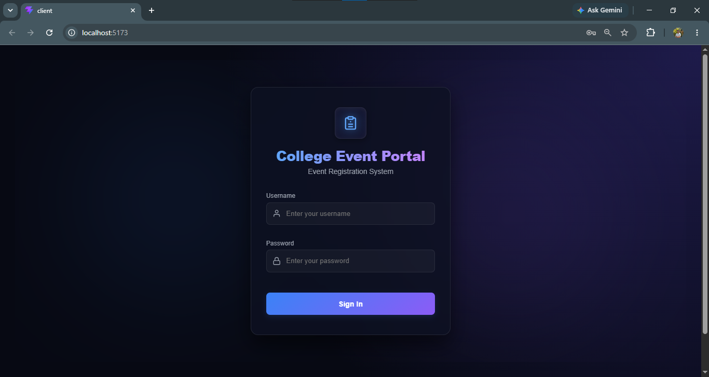
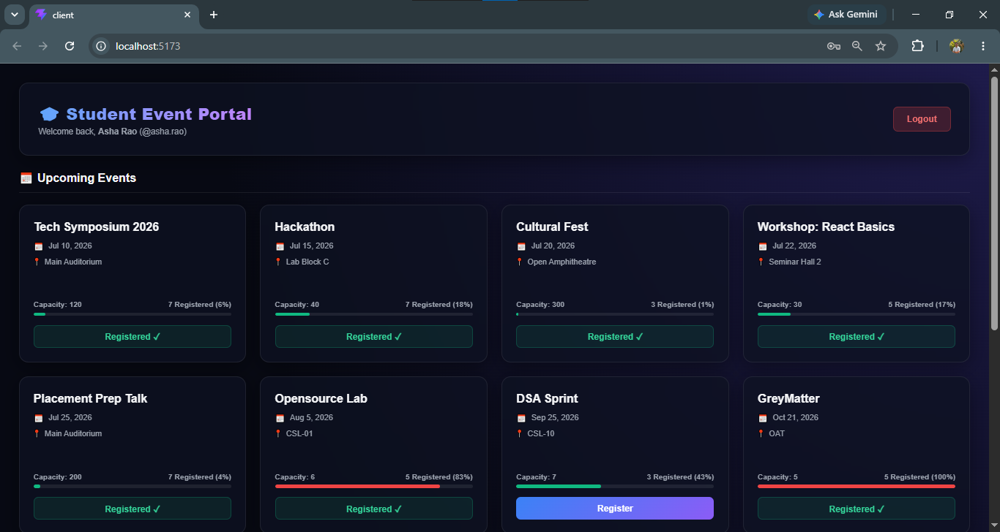
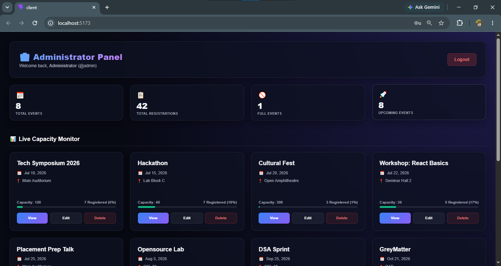

# College Event Registration Portal

A modern, full-stack college event registration platform designed to simplify campus event organization and attendance tracking. The system features a responsive, dark glassmorphism user interface with distinct, role-based workflows for students and administrators.

---

## Project Overview

The **College Event Registration Portal** is built using a clean client-server architecture:
- **Events & Registrations**: Stored and managed inside a MySQL database containing `events` and `registrations` tables.
- **Authentication**: Uses the predefined dataset of student and administrator accounts provided in the assignment specifications. Authentication and view routing are authorized statelessly on the client-side using JSON Web Tokens (JWT). **User accounts are not stored in the database.**
- **Student Dashboard**: Allows authenticated students to explore upcoming campus events, check registration progress bars, register for open events, and review their personal sign-up history.
- **Admin Dashboard**: Provides administrators with control over event management, featuring full database CRUD actions (create, read, update, delete events), a live capacity monitor grid, and student sign-up roster audits.
- **Automated Rules & Validation**: Handles capacity limits (locking registrations when an event is full), prevents duplicate registrations, and provides real-time validation checks for all entries.

---

## Prerequisites

To run this project locally, ensure you have the following installed:
- **Node.js 18+**
- **npm** (Node Package Manager)
- **MySQL 8+**

---

## Quick Start (Summary Setup)

1. **Clone the Repository**:
   ```bash
   git clone <repository-url>
   cd inspirante-shyama
   ```
2. **Install Backend Dependencies**:
   ```bash
   cd server
   npm install
   ```
3. **Configure Environment Variables**:
   Create a `.env` file in the `server` directory and copy the contents from `.env.example` (enter your MySQL connection details).
4. **Set Up the Database**:
   Import `server/seed.sql` into MySQL (creates the database schema and populates default events).
5. **Start the Backend Server**:
   ```bash
   npm run dev
   ```
6. **Start the Frontend Application**:
   Open a new terminal window:
   ```bash
   cd client
   npm install
   npm run dev
   ```

---

## Features

### Student Features
- **Secure Authentication**: Protected logins utilizing JSON Web Tokens (JWT) stored client-side in `localStorage`. Uses predefined student accounts.
- **Live Event Catalog**: Responsive cards displaying upcoming events sorted by date, with dynamic, color-coded capacity indicators.
- **Instant Registration**: One-click event registration with real-time capacity checks and duplicate sign-up block rules.
- **Personal Sign-up Logs**: A table displaying all registered events, sorted and displaying formatted registration dates.
- **Visual Progress Indicators**: Color-coded capacity indicators (`🟢 Below 50%`, `🟠 50% – 79%`, `🔴 80% and above`) showing live enrollment levels.

### Admin Features
- **Administrative Control Panel**: Centered statistics dashboard showing live totals (Total Events, Total Registrations, Full Events, and Upcoming Events).
- **Database CRUD Operations**: Dedicated forms and modals to create new events, edit existing event parameters, and delete events with cascading database cleanup.
- **Live Capacity Monitor**: Grid displaying all events, their current occupancy percentage, and structural baseline alignment.
- **Roster Lookup Audits**: Roster lookup displaying detailed list entries mapping student usernames to full student names with registration timestamps.
- **Deletion Safeguards**: Confirmation warning modals to prevent accidental data loss.

---

## Tech Stack

### Frontend
- **React** (v18+) for dynamic view management and state rendering.
- **Vite** for optimized, fast production compilation.
- **Vanilla CSS** with CSS variables for custom styling, layouts, animations, and responsive breakpoints.

### Backend
- **Node.js** with **Express.js** providing REST-compliant API endpoints.
- **JWT (JSON Web Tokens)** for stateless, secure session authorization.

### Database
- **MySQL** for data persistence, maintaining relational foreign keys between events and registrations.

---

## Project Structure

```
inspirante-shyama/
├── client/                 # Frontend React application
│   ├── src/
│   │   ├── components/     # Reusable layout UI components (e.g., Toast)
│   │   ├── pages/          # View pages (Login, AdminDashboard, StudentDashboard)
│   │   ├── services/       # API call handlers (api.js)
│   │   ├── styles/         # CSS style sheets (index.css)
│   │   ├── utils/          # Frontend helper functions (jwt.js, date.js)
│   │   └── App.jsx         # Main router and toast notification coordinator
└── server/                 # Backend Node.js / Express.js server
    ├── config/             # Database connection pool setup (db.js)
    ├── controllers/        # Route controllers and query functions
    ├── middleware/         # Auth verification and role guard middlewares
    ├── routes/             # Express routing declarations
    └── server.js           # Server startup and middleware mounting configuration
```

---

## Database Setup

Initialize the MySQL database and schema (the database schema consists of the `events` and `registrations` tables only; **there is no users table**).

### Option 1: Using Terminal Command Line
```bash
mysql -u root -p < server/seed.sql
```

### Option 2: Using MySQL Workbench
1. Open MySQL Workbench and connect to your local database instance.
2. Go to **File -> Open SQL Script...** and choose the `server/seed.sql` file.
3. Run the query script.
4. Refresh your schema list; the `event_portal` database containing `events` and `registrations` tables will be created and populated.

---

## Environment Variables

Create a `.env` file in the **`server`** directory:

```env
PORT=3000

DB_HOST=localhost
DB_USER=root
DB_PASSWORD=your_mysql_password
DB_NAME=event_portal

JWT_SECRET=your_jwt_secret_key_here
```

---

## Detailed Installation

### Backend Setup
1. Navigate to the server folder:
   ```bash
   cd server
   ```
2. Install packages:
   ```bash
   npm install
   ```
3. Launch development server:
   ```bash
   npm run dev
   ```

### Frontend Setup
1. Navigate to the client folder:
   ```bash
   cd client
   ```
2. Install packages:
   ```bash
   npm install
   ```
3. Start local development server:
   ```bash
   npm run dev
   ```

---

## Sample Credentials

The portal is designed for an assignment evaluation using a preset configuration of usernames and passwords. **User accounts are not database-driven and cannot be self-registered.**

### Administrator
- **Username**: `admin`
- **Password**: `inspirante2026`

### Predefined Students
- **Username**: `asha.rao`      | **Password**: `student123`
- **Username**: `ravi.shetty`   | **Password**: `student123`
- **Username**: `meera.nair`    | **Password**: `student123`
- **Username**: `kiran.bhat`    | **Password**: `student123`
- **Username**: `divya.kamath`  | **Password**: `student123`
- **Username**: `suresh.pai`    | **Password**: `student123`
- **Username**: `ananya.hegde`  | **Password**: `student123`
- **Username**: `rohan.shenoy`  | **Password**: `student123`
- **Username**: `nisha.prabhu`  | **Password**: `student123`
- **Username**: `tejas.mallya`  | **Password**: `student123`
- **Username**: `priya.bangera` | **Password**: `student123`

---

## API Endpoints

### Authentication
- `POST /api/auth/login` - Authenticate credentials and return JWT token.
- `GET /api/auth/me` - Retrieve info about the currently logged-in user (requires Bearer token).

### Events
- `GET /api/events` - Retrieve all events sorted by date (accessible to all authenticated users).
- `POST /api/events` - Create a new event (requires admin token).
- `PUT /api/events/:id` - Update existing event details (requires admin token).
- `DELETE /api/events/:id` - Delete an event and its registrations (requires admin token).

### Registrations
- `POST /api/register` - Register the logged-in student for a specific event (requires student token).
- `GET /api/my-registrations` - Fetch all event registrations for the logged-in student (requires student token).
- `GET /api/events/:id/registrations` - Fetch student roster registered for a specific event (requires admin token).

---

## Screenshots Section

## Login Page



## Student Dashboard



## Admin Dashboard



---

## Design Decisions

- **Authentication Strategy**: The assignment supplied a fixed dataset of administrator and student logins. The implementation intentionally uses this predefined dataset without storing users in the database, utilizing JWTs for authorization and route protection. This design decision keeps the project focused on event registration, attendance logs, and capacities rather than user management.
- **JWT Authorization**: JSON Web Tokens establish stateless student and admin sessions. Decrypting the payload client-side allows dynamic view routing transitions without requiring redundant authentication roundtrips.
- **Modular React Frontend**: Kept page components focused and decoupled utilities (such as centralized date formatters) into helper files to maximize code reuse and avoid duplicates.
- **Cascading Database Cleanup**: When deleting an event, dependent registrations are cleaned up using transactions/direct queries to prevent database foreign key constraint violations.
- **Vanilla CSS Tokens**: Managed layout spacing, color schemes, gradients, and typography using CSS variables for a consistent theme across all pages.

---

## Troubleshooting

### MySQL Connection Failures
- Verify that your MySQL server instance is active.
- Confirm your `DB_USER`, `DB_PASSWORD`, and `DB_PORT` match the variables in the `server/.env` file.
- Verify that you have successfully executed `server/seed.sql` to initialize the `event_portal` database.

### Port 3000 Already In Use
- The backend server defaults to port `3000`. If you see an address-in-use error, close any running Node processes or adjust the `PORT` variable in the `server/.env` file (remembering to update `BASE_URL` in `client/src/services/api.js` to match).

### Frontend Unable to Reach Backend
- Ensure the backend server is running (`npm run dev` in `server`).
- Verify that your browser doesn't block local network requests or that any active ad-blockers are disabled.

### Missing `.env` Configuration
- Ensure that the `.env` file has been created inside the `server/` directory (not the project root) and contains all required keys.

---

## Known Issues

No major known issues at this time.
Future enhancements are listed in the "Future Improvements" section.

---

## Future Improvements

- **Email Notifications**: Automatically dispatch registration confirmations and event reminders to students.
- **Event Search & Filters**: Enable query searching by name, date range, or venue, as well as filtering by categories.
- **Event Categories**: Implement tags (e.g., *Workshop, Cultural, Hackathon*) to organize events.
- **Image Uploads**: Allow admins to upload promotional banners for events stored on secure CDN storage.

---

## Conclusion

The **College Event Registration Portal** is a clean full-stack web application that helps students discover and register for events while allowing administrators to create, manage, and monitor events efficiently. The project focuses on clean architecture, responsive design, and a smooth user experience.